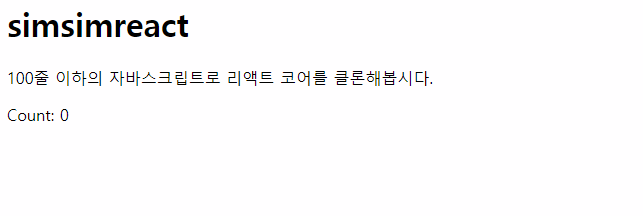

# 클래스형 컴포넌트에 setState 구현

이제 클래스형 컴포넌트에 setState를 통해 상태를 바꿔 화면을 갱신하는 작업을 해봅시다. 그전에 알아야 할게 있습니다.

리액트는 패키지를 최대한 잘게 쪼개놓았습니다. 패키지의 크기도 줄이고 이식성을 좋게 만들기 위함이죠. 리액트의 컴포넌트는 어떤 플랫폼에서 렌더링 되던지 동일한 구조를 갖습니다.

예를들어, 버튼 리액트 컴포넌트는 리액트 네이티브를 통해서 앱에 렌더링되든 웹에서 DOM으로 렌더링 되든 똑같은 구조를 갖죠. 다른것은, 각 플랫폼 별 렌더링 방식입니다. 리액트의 코어는 모두 react 패키지에 들어있습니다.

**react.js** 패키지는 리액트 컴포넌트를 가상돔의 형태로 만들어주는 역할까지만을 담당합니다. 이 가상돔을 실제로 웹에 렌더링하는것은 **react-dom** 패키지의 역할이죠.

react-dom 패키지에서는 **\_\_update** 함수를 구현합니다. 리액트가 가상돔을 이 함수를 통해서 화면에 렌더링하게 되죠.

### src/simsimReactDom.js

```javascript
const reconcile = init([propsModule]);

const simsimReactDom = {
    render: (virtualDom, realDom) => {
        reconcile(realDom, virtualDom);
    },
    __updater: (componentInstance) => {
        const oldVNode = componentInstance.__vNode; // 1. 이전에 저장된 가상돔을 꺼냄
        const newVNode = componentInstance.render(); // 2. 이번에 생성할 가상돔

        // 3. 둘을 비교해서 변경된 부분을 realDOM에 반영하고 현재 virtualDOM 리턴후 저장.
        componentInstance.__vNode = reconcile(oldVNode, newVNode); 
    },
};

export default simsimReactDom;
```

### src/simsimReact.js

```javascript
class Component {
  constructor() { }

  componentDidMount() { }

  setState(partialState) {
    // 1. 컴포넌트의 setState가 호출되면 새로운 상태를 만듭니다.
    this.state = {
      ...this.state,
      ...partialState
    }
    // 2. react-dom의 __updater 함수를 호출합니다. 
    simsimReactDom.__updater(this);
  }

  render() { }
}
```

1번에서 새로운 상태를 만드는 이유는 리액트에서는 불변성을 유지해줘야하기 때문입니다. \(shallow-comparison\) 그리고나서 자기자신의 인스턴스를 react-dom의 \_\_updater함수에 전달해서 본인이 render메소드에 가지고 있는 virtualDOM을 화면에 렌더링하는것이죠.

이런식으로 react와 react-dom은 서로 분업을 합니다.

자 이제 우리는 setState를 통해 컴포넌트의 상태를 변경하고, 그 변경된 상태에 맞춰 react-dom의 \_\_updater를 호출하여 이전 가상돔과 현재 가상돔을 비교하여 화면에 리렌더링 할 수 있게 되었습니다.

그럼 아까 만들어놨던 Counter컴포넌트에서 1초에 한번씩 카운터를 증가시키는 작업을 해보죠.

### src/counter.js

```javascript
class Counter extends simsimReact.Component {
  constructor(props) {
    super(props);

    this.state = {
      count: 0
    }

    setInterval(() => {
      this.setState({
        count: this.state.count + 1
      })
    }, 1000);
  }

  componentDidMount() {
    console.log('컴포넌트가 마운트 되었습니다.');
  }

  render() {
    return <p>Count: {this.state.count}</p>
  }
}
```



1초에 한번씩 카운트가 증가되고 있습니다.

## ComponentDidMount life cycle hook 추가하기

snabbdom에는 virtualDOM이 realDOM에 반영되었을때 실행되는 훅을 제공해줍니다.

### src/simsimReact.js

```javascript
const createElement = (type, props = {}, ...children) => {
  if (type.prototype && type.prototype.isSimsimReactClassComponent) {
        const componentInstance = new type(props);
        componentInstance.__vNode = componentInstance.render();
    componentInstance.__vNode.data.hook = {
            // realDOM에 반영(create)되었을때 컴포넌트인스턴스의 componentDidMount 함수 호출
      create: () => {
        componentInstance.componentDidMount()
      }
    }
    return componentInstance.__vNode;
  }
  if (typeof type == "function") {
    return type(props);
  }
  return h(type, { props }, children);
};
```

콘솔을 확인해보세요. "컴포넌트가 마운트 되었습니다" 라는 문장이 보이시나요?

